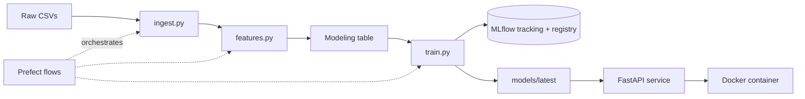

# Olist Bad Review Prediction: End-to-End MLOps

Predicts which e-commerce orders will receive a negative review (1–2 stars) using the
[Olist Brazilian E-Commerce dataset](https://www.kaggle.com/datasets/olistbr/brazilian-ecommerce).
Negative reviews serve as a proxy for customer dissatisfaction and returns, so flagged orders
can be targeted with proactive outreach.

The project takes a model from notebook to a containerized prediction service, with experiment
tracking, a model registry, orchestrated retraining, and tested pipeline code.

## Architecture



## Results

| Model | Valid PR-AUC | Valid ROC-AUC |
|---|---|---|
| Logistic regression (baseline) | 0.357 | 0.739 |
| **LightGBM** | **0.400** | **0.739** |

Final LightGBM performance on the held-out test set (Jun–Aug 2018):

| Metric | Value |
|---|---|
| PR-AUC | 0.309 (base rate 0.097) |
| ROC-AUC | 0.684 |
| Precision @ threshold 0.22 | 0.451 |
| Recall @ threshold 0.22 | 0.274 |

The decision threshold was chosen on validation by maximizing F1.

## Key findings

- **Delivery delay is the dominant driver** of bad reviews, followed by the number of items
  in an order. Multi-item orders often ship separately and arrive incomplete.
- **The label rate declines over time** (14.0% train → 11.3% valid → 9.7% test), mainly because
  late deliveries fell by half in 2018. Late orders in later periods also produced fewer bad
  reviews, possibly because very late orders were still undelivered when the data was pulled.
- **The time-based split was kept as-is** to reflect realistic production performance. The drop
  from validation to test PR-AUC is an expected result of this shift, not overfitting.

## Monthly retraining replay

A Prefect flow simulates production by retraining each month on the data available so far
and scoring the following month.

| Month | PR-AUC | Base rate | Lift |
|---|---|---|---|
| 2018-01 | 0.511 | 0.137 | 3.7x |
| 2018-02 | 0.641 | 0.194 | 3.3x |
| 2018-03 | 0.672 | 0.212 | 3.2x |
| 2018-04 | 0.435 | 0.118 | 3.7x |
| 2018-05 | 0.364 | 0.108 | 3.4x |
| 2018-06 | 0.280 | 0.100 | 2.8x |
| 2018-07 | 0.283 | 0.097 | 2.9x |
| 2018-08 | 0.375 | 0.095 | 3.9x |

Raw PR-AUC swings with the share of late deliveries, peaking during the Feb–Mar 2018 delivery
spike, but lift over the base rate stays between 2.8x and 3.9x. The model is stable; the
amount of predictable, delivery-driven dissatisfaction is what changes.

## Design decisions

- **No leakage:** features use only information available by delivery time. Review text and
  review dates are excluded.
- **Time-based split:** train < Apr 2018, valid Apr–May 2018, test Jun–Aug 2018.
- **PR-AUC over accuracy:** the classes are imbalanced, and base rates differ across splits.
- **Test set evaluated once**, after all model and threshold decisions were made on validation.

## Project structure

```
src/olist_returns/
├── config.py      # paths, features, split dates, params
├── ingest.py      # load raw CSVs
├── features.py    # build the modeling table
├── train.py       # train, choose threshold, log and register model
├── predict.py     # load model and score orders
├── api.py         # FastAPI service
└── flows.py       # Prefect training and monthly replay flows
notebooks/         # EDA and model development
tests/             # unit tests
Dockerfile
```

## How to run

**Setup**
```bash
conda create -n olist-returns python=3.13 -y
conda activate olist-returns
pip install -r requirements-dev.txt
pip install -e .
```
Download the dataset from Kaggle and unzip the CSVs into `data/raw/`.

**Pipeline**
```bash
python -m olist_returns.features   # build the modeling table
python -m olist_returns.train      # train and register the model
pytest                             # run tests
```

**Orchestrated with Prefect**
```bash
python -m olist_returns.flows          # full training pipeline
python -m olist_returns.flows replay   # monthly retraining replay
```

**API with Docker**
```bash
docker build -t olist-api .
docker run -p 8080:8080 olist-api
```
Then open `http://localhost:8080/docs` to try the `/health` and `/predict` endpoints.

## Roadmap

- [x] EDA, leak-free features, time-based split
- [x] Baseline and LightGBM models with MLflow tracking
- [x] Modular pipeline with unit tests
- [x] FastAPI prediction service
- [x] Docker containerization
- [x] Prefect orchestration with monthly retraining
- [ ] Deployment to GCP Cloud Run
- [ ] Drift monitoring with Evidently
- [ ] CI/CD with GitHub Actions

## Author

Mason Fuller · [LinkedIn](https://linkedin.com/in/mason1fuller)